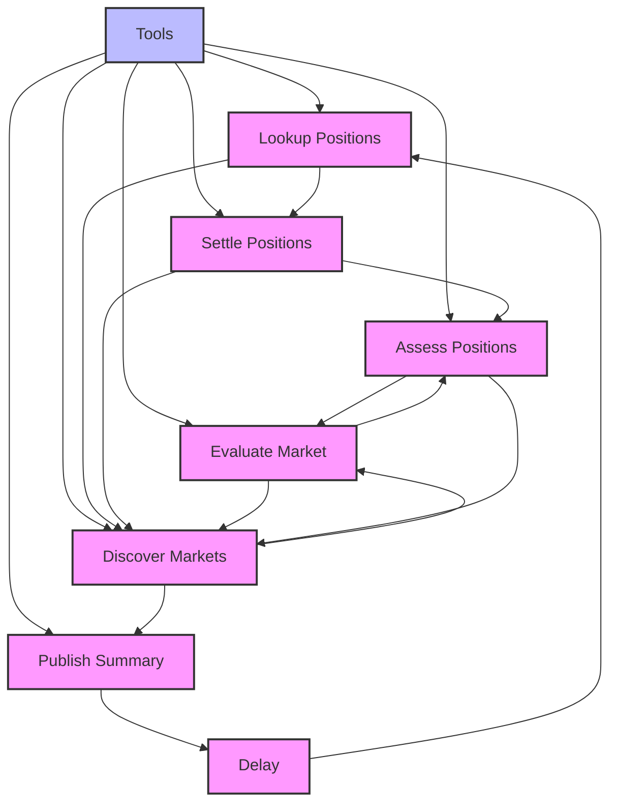

# Agent Graph Visualization

```mermaid
graph TD;
  lookup[Lookup Positions]:::node;
  settle_positions[Settle Positions]:::node;
  assess_positions[Assess Positions]:::node;
  discover_markets[Discover Markets]:::node;
  evaluate_market[Evaluate Market]:::node;
  publish_summary[Publish Summary]:::node;
  delay[Delay]:::node;
  tools[Tools]:::tool;
  tools --> lookup;
  tools --> settle_positions;
  tools --> assess_positions;
  tools --> discover_markets;
  tools --> evaluate_market;
  tools --> publish_summary;
  lookup --> settle_positions;
  lookup --> discover_markets;
  settle_positions --> assess_positions;
  settle_positions --> discover_markets;
  assess_positions --> evaluate_market;
  evaluate_market --> assess_positions;
  discover_markets --> evaluate_market;
  evaluate_market --> discover_markets;
  assess_positions --> discover_markets;
  discover_markets --> publish_summary;
  publish_summary --> delay;
  delay --> lookup;

classDef node fill:#f9f,stroke:#333,stroke-width:2px;
classDef tool fill:#bbf,stroke:#333,stroke-width:2px;

```
